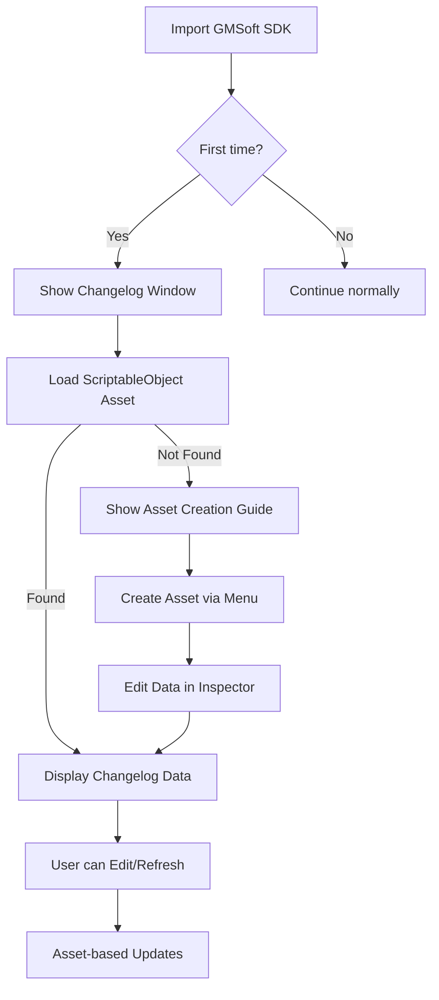

# GMSoft SDK v7 - Changelog Window System

## 📋 Tổng quan

Hệ thống Changelog Window cho GMSoft SDK v7 được thiết kế để hiển thị các thay đổi và cập nhật của SDK một cách trực quan và thân thiện với người dùng. **Dữ liệu changelog được quản lý thông qua ScriptableObject** cho phép editing dễ dàng và version control tốt.

## 🎯 Tính năng chính

### 1. **Tự động hiển thị khi import lần đầu**
- Sử dụng `InitializeOnLoad` để detect việc import SDK lần đầu
- Tự động mở Changelog Window khi SDK được import vào dự án mới
- Lưu trạng thái trong EditorPrefs để không hiển thị lại

### 2. **Truy cập từ Menu GMSoft** 
- Menu item: `GMSoft > Changelog`
- Có thể mở bất cứ lúc nào từ Unity Editor

### 3. **ScriptableObject-Based Data Management**
- **ScriptableObject asset** để lưu trữ changelog data
- **Inspector-friendly** cho việc edit và maintenance
- **Version control ready** với .asset files
- **Auto-discovery** tìm changelog asset trong project

### 4. **Giao diện người dùng**
- Hiển thị thông tin repository và asset path
- Phân loại thay đổi với icon và màu sắc:
  - ✨ **New Features** (màu xanh lá)
  - 🔧 **Improvements** (màu xanh dương) 
  - 🐛 **Bug Fixes** (màu cam)
  - ⚠️ **Breaking Changes** (màu đỏ)
- **Edit Asset** button để mở asset trong Inspector
- Scroll view để xem nhiều phiên bản
- Title và description support cho mỗi entry

### 5. **Rich Content Support**
- **Version và Date** cho mỗi entry
- **Title và Description** text areas
- **Categorized Changes** với importance levels
- **Flexible Data Structure** cho future enhancements

## 📁 Cấu trúc Files

```
Assets/GMSoft/Editor/
├── ChangelogData.cs                  # Basic data models 
├── ChangelogScriptableObject.cs      # ScriptableObject definition và converter
├── ChangelogWindow.cs                # Main window implementation
├── GMSoftSDKInitializer.cs           # Auto-show logic
├── GMSoft_Changelog.asset            # Actual changelog data asset
├── ChangelogSettings.json            # Settings configuration
├── ChangelogWindow_README.md         # Basic usage guide
└── CHANGELOG_SYSTEM_DOCS.md          # Comprehensive documentation
```

## � ScriptableObject Structure

### ChangelogScriptableObject
```csharp
[CreateAssetMenu(fileName = "GMSoft_Changelog", menuName = "GMSoft/Changelog Data")]
public class ChangelogScriptableObject : ScriptableObject
{
    public string repositoryUrl;
    public string branchName;
    public List<ChangelogEntryData> entries;
}
```

### ChangelogEntryData
```csharp
[System.Serializable]
public class ChangelogEntryData
{
    public string version;
    public string date;
    [TextArea] public string title;
    [TextArea] public string description;
    public List<ChangeItem> newFeatures;
    public List<ChangeItem> improvements;
    public List<ChangeItem> bugFixes;
    public List<ChangeItem> breakingChanges;
}
```

### ChangeItem
```csharp
[System.Serializable]
public class ChangeItem
{
    [TextArea] public string description;
    public string category;
    public ChangeImportance importance;
}
```

## 🔧 Cấu hình

### Quick Start
1. **Create changelog asset**: Right-click Project > Create > GMSoft > Changelog Data
2. **Đặt tên**: Name file `GMSoft_Changelog` (recommended)
3. **Edit data**: Fill in changelog entries trong Inspector
4. **Configure**: Window > GMSoft > Changelog Settings để set asset path
5. **View**: Window > GMSoft > Changelog để xem

### Sample Usage
```
1. Tạo asset:
   - Right-click trong Project window
   - Chọn Create > GMSoft > Changelog Data  
   - Tên file: GMSoft_Changelog

2. Fill data in Inspector:
   - Version: "v7.1.0"
   - Release Date: "2024-01-15"
   - Description: "Major update with new features"
   - Changes: Add individual change items với importance level

3. Access via menu:
   - Window > GMSoft > Changelog
   - Auto-shows on first import
```

### Settings Configuration
```json
{
  "gitUrl": "http://123.24.143.6:8080/scm/git/gmsoft-sdk",
  "changelogAssetPath": "Assets/GMSoft/GMSoft_Changelog.asset"
}
  "branch": "gmsoft-sdk-v7",
  "changelogAssetPath": "Assets/GMSoft/Editor/GMSoft_Changelog.asset",
  "hasShownWelcome": false,
  "lastViewedVersion": ""
}
```

### Asset Creation
1. **Right Click** trong Project window
2. **Create > GMSoft > Changelog Data**
3. **Configure** entries trong Inspector
4. **Save** và window sẽ tự động detect

### Entry Configuration trong Inspector
```
Version: 7.2.1
Date: 2025-08-22
Title: Bug Fixes and Performance Improvements
Description: This release focuses on fixing critical bugs...

New Features:
- Description: Added new analytics tracking
  Category: Analytics  
  Importance: Normal

Bug Fixes:
- Description: Fixed WebGL loading issues
  Category: WebGL
  Importance: High
```

## 🚀 Cách sử dụng

### Cho Developer
1. **Create/Edit Changelog**: Right-click > Create > GMSoft > Changelog Data
2. **Update Entries**: Edit asset trong Inspector với visual interface
3. **Asset Settings**: Configure path trong Settings window
4. **Version Control**: Commit .asset file như normal Unity asset
5. **Auto-sorting**: Entries được auto-sort theo version number

### Cho End User
1. **Xem changelog**: `GMSoft > Changelog`
2. **Refresh data**: Click nút "Refresh" để reload asset
3. **Edit asset**: Click nút "Edit Asset" để mở trong Inspector  
4. **Mở repository**: Click nút "Open Repository"
5. **Cấu hình**: Click nút "Settings" để thay đổi asset path

## 🔄 ScriptableObject Workflow



### Asset Management Strategy
1. **First Load**: Check for configured asset path
2. **Asset Detection**: Auto-find changelog assets in project
3. **Manual Refresh**: Reload asset data on demand
4. **Inspector Editing**: Direct editing via Unity Inspector
5. **Version Control**: Asset files tracked như normal Unity assets

## 🎨 UI Components

### Main Window
- **Header**: SDK name và API endpoint info
- **Toolbar**: Refresh (force API reload), Open Repository, Settings buttons
- **Content Area**: Scrollable changelog entries từ API
- **Loading State**: Progress indicator khi fetch API
- **Error State**: Friendly error messages với retry button

### Settings Window  
- **Git URL**: Đường dẫn repository (for reference)
- **Branch**: Tên branch để theo dõi
- **API URL**: REST endpoint để fetch changelog
- **Cache Settings**: Thời gian cache expire (5-120 minutes)
- **Modal dialog**: Save/Cancel buttons

## 📈 Mở rộng tương lai

### Advanced API Features
- **Authentication**: API key hoặc token-based auth
- **Pagination**: Hỗ trợ changelog history lớn
- **Filtering**: Server-side filtering theo date range, version
- **Real-time Updates**: WebSocket notifications cho updates mới

### Enhanced Parsing
- **Rich Content**: Hỗ trợ images, links, code blocks trong changelog
- **Custom Sections**: User-defined section types và icons
- **Localization**: Multi-language changelog support
- **Version Comparison**: Side-by-side version diffs

### User Experience
- **Smart Notifications**: Desktop notifications cho updates quan trọng
- **Badge System**: Visual indicators trong Unity cho new versions
- **Search & Filter**: Client-side search trong changelog content
- **Bookmarks**: Save và organize favorite changelog entries

### Integration
- **CI/CD Hooks**: Auto-update changelog từ build pipeline
- **Git Integration**: Direct parsing from Git commits và tags
- **Slack/Discord**: Bot notifications cho team updates

## 🐛 Troubleshooting

### API Connection Issues
- **"Network error"**: Kiểm tra internet connection và API endpoint
- **"Request timeout"**: API server có thể quá chậm (>30s)
- **"Invalid API response"**: Check API response format theo documentation
- **"Branch not found"**: Verify branch name trong settings

### Caching Problems  
- **Data không update**: Check cache expiry time, có thể cần force refresh
- **"Cache expired"**: Normal behavior, sẽ auto-fetch new data
- **Performance issues**: Giảm cache expiry time nếu cần data realtime hơn

### Parsing Errors
- **Changelog trống**: API content có thể không đúng markdown format
- **Missing sections**: Check markdown headers theo supported keywords
- **Garbled text**: Encoding issues từ API response

### General Issues
- **Window không tự động mở**: Clear EditorPrefs: `EditorPrefs.DeleteKey("GMSoft_WelcomeShown_v7")`
- **Settings không lưu**: Kiểm tra quyền write trong project folder
- **Console errors**: Check Unity Console cho detailed error messages

## 📝 Notes

- **Unity Version**: Tương thích với Unity 2021.3+
- **Dependencies**: Newtonsoft.Json, System.Net.Http
- **Platform**: Unity Editor only (Editor scripts)
- **Performance**: Lightweight với intelligent caching
- **Network**: Requires internet connection for initial load
- **Offline**: Graceful degradation với cached data
- **API Format**: REST JSON API với markdown content
- **Security**: HTTPS recommended cho production API

---

**Author**: GMSoft Development Team  
**Version**: 7.2.1  
**Last Updated**: August 22, 2025
